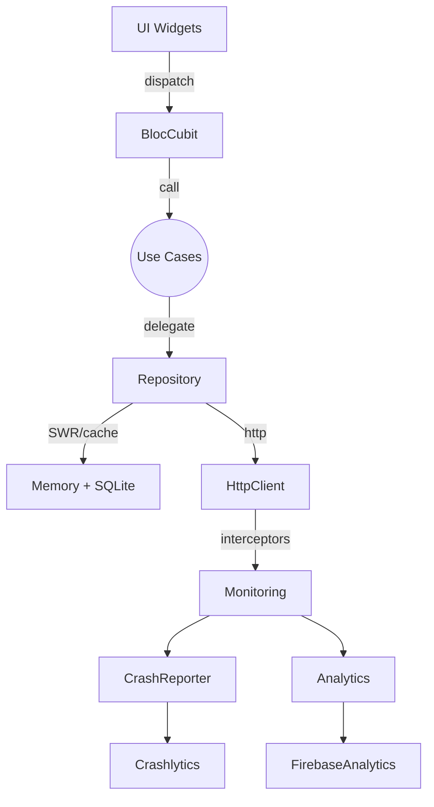

# Flutter Core Technical Overview

- **Goal & Audience**
  - Standardize how the `flutter_core` module enables Clean Architecture across mobile squads.
  - Target readers: senior Flutter engineers, technical leads, reviewers onboarding or auditing the shared layer.

- **Scope**
  - Covers `foundation`, `data`, `domain`, `presentation` packages inside `shared_packages/flutter_core`.
  - Describes dependency injection with `get_it` + `injectable`, Result/Failure, caching with TTL + SWR, Bloc/Cubit support, monitoring (crash + analytics).
  - Does not expose concrete endpoints or base URLs; the application layer owns that configuration.

## Architecture Overview

The library is structured around Clean Architecture with barrel exports (`data.dart`, `domain.dart`, `foundation.dart`, `presentation.dart`). The main collaboration flow is illustrated below:



- `foundation` defines primitives (Result, Failure, Logger, monitoring contracts).
- `domain` exposes business interfaces plus shared services such as `AnalyticsService`.
- `data` implements network/cache/database details and maps infrastructure errors to domain `Failure` instances.
- `presentation` consolidates Bloc/Cubit base classes, the effect stream, observers, and navigation observers.

## Dependency Injection (`get_it` + `injectable`)

- `src/di/injector.dart` declares `@InjectableInit.microPackage()` so the host app can call `initMicroPackage()` from its root injector.
- Modules provided by the package:
  - `NetworkModule` (`src/di/module/network_module.dart`) wires `Dio`, the default retry policy, and the base interceptor (`CrashBreadcrumbInterceptor`).
  - `ThirdPartyModule` (`src/di/module/third_party_module.dart`) binds Firebase Crashlytics and Firebase Analytics singletons.
- Generated file `injector.module.dart` registers lazy singletons and singletons in GetIt:
  - `HttpClient` → `DioHttpClient` (`src/data/network/http_client.dart`).
  - `CrashBlocObserver`, `CrashRouteObserver`, `GARouteObserver`.
  - `AnalyticsService` → `AnalyticsServiceImpl`.
- The application layer may override bindings (for example additional interceptors) by registering instances with the same `@Named` key before invoking `initMicroPackage()`.

## Result / Failure Handling

- `Result<T>` (`foundation/result.dart`) is a sealed class equivalent to an Either with `success` and `failure` cases.
- The `Failure` hierarchy (`foundation/failure.dart`) separates `code`, `message`, `retryable`, `cause`, and `stackTrace` fields.
- `RepoErrorMapper` (`data/exceptions/exception_mapper.dart`) converts infrastructure exceptions into `Failure` using constants from `ErrorCodes`.
- `Result.guard` wraps async operations and turns thrown errors into `Failure`; `BaseBloc` and `BaseCubit` expose `runResult` / `reduceResult` helpers so presentation code can consume `Result` consistently.

## Bloc / Cubit Base Layer

- `BaseBloc` and `BaseCubit` (`presentation/bloc/base_bloc.dart`, `base_cubit.dart`) include:
  - `EffectEmitter` for emitting one-shot side effects.
  - Race-condition protection via operation sequencing per `trackKey`.
  - Structured logging through the optional `Logger` adapter (`foundation/logger.dart`).
  - Automatic timing capture and Failure forwarding to effects using `toErrorEffect`.
- `CrashBlocObserver` (`presentation/bloc/crash_bloc_observer.dart`) should be injected into `Bloc.observer` to add breadcrumbs and report errors through the `CrashReporter`.
- Usage guidelines:
  - Provide distinct `trackKey` values for concurrent tasks (for example `loadList`, `refresh`).
  - Prefer `runResult` for use cases returning `Future<Result<T>>` to avoid scattered try/catch blocks.
  - Implement `AnalyticsMappableEffect` on effects that must trigger analytics automatically.

## Caching with TTL + SWR

- `BaseCacheRepository` (`data/repository/base_cache_repository.dart`) offers two strategies:
  - `swr`: stream-based Stale-While-Revalidate combining RAM → disk → remote with in-flight de-duplication.
  - `networkFirst`: remote-first with graceful fallback to RAM/disk when the network fails.
- Components:
  - `MemoryCache` (`data/caching/memory/memory_cache.dart`) provides in-process TTL.
  - Persistent storage is supplied by the app through DAOs (`BaseSqfliteDao`, `KeyValueCacheDao`).
  - `CachePolicy` / `TtlPolicy` with presets in `cache_presets.dart` define soft and hard TTL (hard TTL controls whether disk snapshots may be rendered).
  - `CacheEntry` stores the payload and its `fetchedAt` timestamp.
- Preset reference:

| Use case (`CacheUseCase`) | memTtl | ttl | hardTtl | revalidateIfOlderThan | jitter |
| --- | --- | --- | --- | --- | --- |
| `realtimeShortLived` | 20s | 45s | 10m | 15s | 15% |
| `fastOpenInteractive` | 2m | 7m | 12h | 2m | 10% |
| `readMostlyDetail` | 3m | 20m | 3d | 5m | 10% |
| `staticCatalog` | ∞ | 3d | 21d | 6h | 5% |
| ... | ... | ... | ... | ... | ... |

- Typical repository usage:

```dart
class ProfileRepository extends BaseCacheRepository {
  ProfileRepository({required MemoryCache mem}) : super(mem: mem);

  Stream<UserProfile> watchProfile(String userId) => swr<UserProfile>(
        key: 'profile:$userId',
        policy: CacheUseCasePresets.readMostlyDetail.policy,
        remote: () => api.fetchProfile(userId),
        local: () => dao.getByIdWithMeta(userId),
        saveLocal: dao.upsert,
        memTtl: CacheUseCasePresets.readMostlyDetail.memTtl,
        revalidateIfOlderThan: CacheUseCasePresets.readMostlyDetail.revalidateIfOlderThan,
        jitterPct: CacheUseCasePresets.readMostlyDetail.jitterPct,
      );
}
```

- Hard TTL is enforced during the disk step; when expired the snapshot is skipped and the flow requests fresh data. `_inFlight` prevents multiple remote requests for the same `key` from running simultaneously.

## Network Layer & Interceptors

- `DioHttpClient` (`data/network/http_client.dart`) wraps Dio with:
  - Retry support (`RetryPolicy`, `ExponentialBackoff` in `retry_policies.dart`) with optional `retryNonIdempotent` override supplied via DI.
  - A custom interceptor chain where `onRequest` runs in declaration order while `onResponse` and `onError` run in reverse order.
  - No default `baseUrl`; the application must configure `dio.options.baseUrl` and headers.
  - Immutable `HttpRequest` objects featuring `retryOverride` and `cancelToken`.
  - `HttpResponse` instances automatically processed by `CrashBreadcrumbInterceptor`.
- `CrashBreadcrumbInterceptor` logs sanitized request/response metadata as crash breadcrumbs and analytics events (`http_request`, `http_response`, `http_error`) while hiding full URIs.

## Error Handling & UI Mapping

- Presentation code should convert `Failure` into `ErrorUiModel` (`presentation/bloc/model/error_ui_model.dart`) to translate error codes into localization keys.
- Wrap repository calls with `RepoErrorMapper.guard` to emit `Result` instead of exceptions.
- `Failure.retryable` indicates whether the UI should expose a retry action.
- The `Logger` abstraction allows injecting custom adapters (e.g., Sentry breadcrumbs). Use `LoggerProvider.instance` for a global fallback if required.

## Crash Reporting & Analytics

- Crash reporting:
  - `CrashReporter` interface plus `NoopCrashReporter`; default implementation is `FirebaseCrashReporter` (`foundation/monitoring/adapters/firebase_crash_reporter.dart`).
  - Methods ensure values are serializable before forwarding to Crashlytics (`recordError`, `addBreadcrumb`, `setUser`, `setCustomKeys`).
  - `recordFlutterError` wraps `FlutterError.onError` to enrich reports with library and Diagnostics information.
- Analytics:
  - `Analytics` abstraction with default implementation `FirebaseGAAnalytics` (`data/monitoring/ga/firebase_ga_analytics.dart`), auto-disabling collection in debug builds.
  - `AnalyticsService` domain layer + `AnalyticsServiceImpl` (`domain/analytics`) normalize event names (snake_case) and map commerce payloads.
  - `EffectEmitter` can mix in `AnalyticsEffectEmitter` to automatically forward effect metadata to analytics.
  - Navigation observers (`GARouteObserver`, `CrashRouteObserver`) log screen views and breadcrumbs.

## Integration Checklist for Applications

1. Set `LoggerProvider.instance` before creating Bloc/Cubit instances.
2. Call `initMicroPackage()` after configuring the root GetIt container.
3. Assign `Bloc.observer = tpGetIt<CrashBlocObserver>()`.
4. Register navigator observers: `GARouteObserver` and `CrashRouteObserver`.
5. Use `BaseCacheRepository` (SWR/NetworkFirst) with appropriate cache presets in repositories.
6. Return `Result` from async use cases or wrap calls with `RepoErrorMapper.guard`.
7. Initialize crash reporting and analytics SDKs during bootstrap (disable in debug as needed).
8. Keep endpoints and base URLs outside the shared module; configure them in the app layer via Dio.
9. Register new `DBModule` instances before calling `AppDatabase.open()` when extending the schema.
10. Ensure significant effects provide analytics metadata or an effect mapper to avoid missing events.
